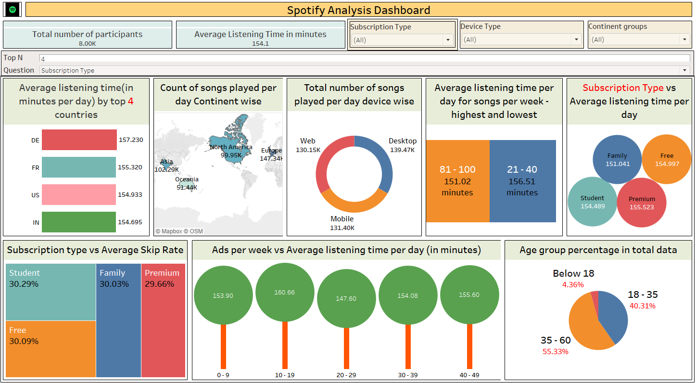

🎧 Spotify Analysis Dashboard (Tableau)
📌 Project Overview

This project showcases an interactive Tableau Dashboard built on Spotify usage data, analyzing user listening behavior across demographics, subscription types, devices, and geographies. The dashboard highlights engagement patterns, skip rates, and ad exposure effects to provide actionable insights.

📊 Key Features

Unique Chart Types Used

Donut Chart → Songs played per device type

Lollipop Chart → Ads per week vs Average listening time per day

Treemap & Bubble Charts → Skip rates & parameter-driven insights

Map Visualization → Continent-wise distribution of songs played

Country Groupings

Created custom groups for countries aggregated into continent groups for better regional analysis.

Parameters for Interactivity

Top N Filter → Dynamically view top N countries by average listening time (used in 1st chart).

Question Parameter → Switch between dimensions (Age group, Gender, Offline listening, Subscription Type, Device Type) in the bubble chart for flexible insights.

KPI Highlights

8,000 participants analyzed

Average listening time → 154.1 minutes/day

Device usage split: Desktop (139.47K), Mobile (131.40K), Web (130.15K)

Subscription engagement: Premium users listen the most (~155.5 mins/day)

Demographics: Majority users fall in the 35–60 age group (55.3%)

🔍 Insights Derived

Geography: Europe and Asia show the highest engagement in daily song plays.

Subscription: Listening time differences are minimal, but Premium slightly leads in average minutes.

Ads Impact: Listening time fluctuates across ad exposure categories, with optimal engagement seen at mid-level exposure (10–19 ads/week).

Demographics: While 35–60 age group dominates the user base, 18–35 group shows stronger engagement per capita.

🛠️ Skills Demonstrated

Tableau Desktop Public Edition

Dashboard Design & Layouting

Parameters & Dynamic Filtering

Groups & Hierarchies for Regional Insights

Advanced Visualizations (Donut, Lollipop, Treemap, Bubble, Maps)

KPI & Comparative Analysis

📌 Use Case

This dashboard can help music streaming platforms like Spotify to:

Analyze user engagement across regions and devices

Improve subscription strategies

Optimize ad placements

Personalize user recommendations

📷 Dashboard Preview

Here are some snapshots of the dashboard:

